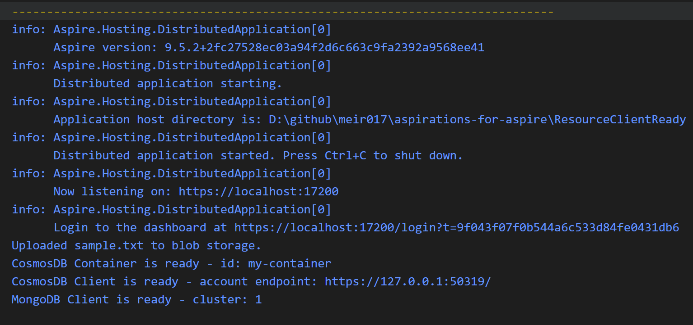

# ResourceClientReady Demo

This demo demonstrates how to use Aspire's resource client readiness functionality in a distributed application.

sample console output:


## Overview

The `AppHost.cs` file contains the configuration for an Aspire application that showcases resource dependency management and client readiness patterns.

## Key Features

- **Resource Dependencies**: Shows how to configure dependencies between different services
- **Client Readiness**: Demonstrates waiting for resources to be ready before starting dependent services
- **Service Discovery**: Utilizes Aspire's built-in service discovery mechanisms

## Getting Started

1. Ensure you have .NET 8.0 or later installed
2. Navigate to the project directory
3. Run the application:
    ```bash
    dotnet run --project AppHost
    ```

## Architecture

The demo includes multiple services that depend on each other, demonstrating how Aspire handles:
- Service startup ordering
- Health checks and readiness probes
- Graceful dependency resolution

## Learn More

For more information about .NET Aspire and resource management, visit the [official documentation](https://learn.microsoft.com/en-us/dotnet/aspire/).